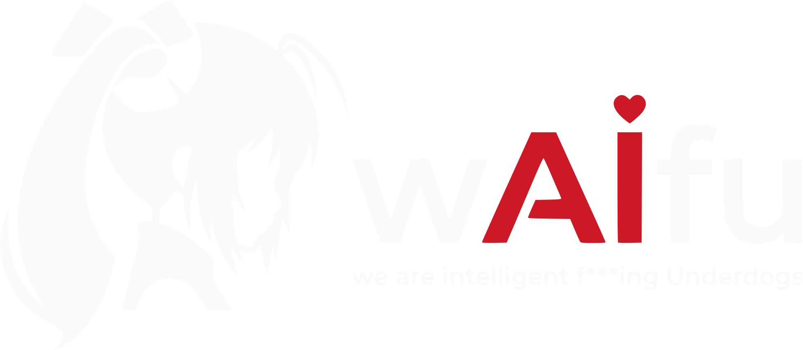

<p align="center">
  
</p>

<h1 align="center">SocialSkills</h1>

<p align="center">
  <strong>AI content skills and brand-native social art, without the Canva Enterprise wall.</strong>
</p>

<p align="center">
  <a href="LICENSE"></a>
  <a href="canva-killer/"></a>
  
  
</p>

<p align="center">
  <a href="#why-it-exists">Why</a> |
  <a href="#what-you-can-build">Build</a> |
  <a href="#quick-start">Quick start</a> |
  <a href="#repo-map">Repo map</a> |
  <a href="#roadmap">Roadmap</a>
</p>

---

SocialSkills is a local, agent-friendly content studio for people who want their AI to make
useful brand content instead of weird generic slop.

It combines two things:

- **Content skills** for Claude Code: brand voice, SEO, competitor research, Google Ads audits,
  content writing and channel-specific drafting.
- **[canva-killer](canva-killer/)**: a local social art generator where templates are code
  (HTML/CSS/SVG) and an AI agent fills them with your brand, title, image and CTA.

The mascot is a chameleon for a reason: SocialSkills has no fixed visual identity when it is
working for you. It takes on your brand's colors, fonts and voice.

## Why it exists

Canva has an official MCP, but the automation feature that matters most for agents,
**template autofill**, is locked behind the Enterprise plan.

SocialSkills gives you the useful part locally:

| Instead of... | You get... |
|---|---|
| an AI "drawing" a random ugly post | code templates filled with real brand tokens |
| proprietary template files | HTML/CSS/SVG that can live in git |
| manual Canva assembly | MCP-drivable rendering and export |
| generic AI copy | brand voice extracted from real samples |
| one-off assets | a repeatable content pipeline |

You lose Canva's giant ready-made asset catalog. You gain control, versioning, automation and
templates your AI can actually understand.

## What you can build

### Brand-native social art

Use `canva-killer` to render Instagram posts, stories, carousel slides and blog covers from
brand JSON + template HTML + post data.

```text
brand + template + post data -> PNG
```

Templates expose `{{tokens}}`. Agents fill the tokens. Humans can still edit the template.

### Channel-aware writing

The skills under `plugins/marketing-tools/` help an agent:

- interview a brand and build a voice profile;
- write LinkedIn, Instagram, blog and TikTok-style content;
- research competitors and content gaps;
- audit ads and SEO basics;
- reuse the same brand profile across channels.

### A private content workspace

Your real brands, exported art and private channel plugins live under `user/`, which is gitignored.
The public framework stays clean; your client or personal brand data does not leak into commits.

## Quick start

Render social art locally:

```bash
cd canva-killer
npm install
npm run studio
```

Open the Studio at:

```text
http://localhost:4173
```

Use the tabs this way:

| Tab | Purpose |
|---|---|
| **Compose** | Fill a finished template and export PNGs |
| **Create/edit** | Build or edit the layout itself |
| **Brand** | Edit palette, fonts and logo data |

For direct rendering, see [canva-killer/README.md](canva-killer/README.md).

## Repo map

```text
plugins/marketing-tools/  # generic SEO, Ads and content skills
canva-killer/             # local art generator, Studio and MCP server
identity/                 # SocialSkills chameleon identity
_templates/               # skeletons for new brands/channels/templates
user/                     # your private brands, outputs and plugins (gitignored)
```

Framework code is public and versioned. Real user content belongs in `user/`.

## How the private overlay works

`canva-killer` resolves brands, templates and assets by overlay:

```text
user/canva-killer/...  -> checked first
canva-killer/...       -> framework fallback
```

That means one checkout can be both:

- a public framework repo with examples and templates;
- a private working studio with real brands, palettes, logos and exports.

Suggested private layout:

```text
user/plugins/<brand>/           # real brand plugins and channel skills
user/canva-killer/brands/       # brand palette, fonts, logo, handle
user/canva-killer/assets/       # authored SVGs, logos, custom icons
user/canva-killer/templates/    # brand-specific templates
user/canva-killer/out/          # exported PNGs
```

To create a brand or channel, start with [_templates/README.md](_templates/README.md).

## Agent setup

Register brand plugins in:

```text
.claude-plugin/marketplace.json
```

MCP paths are configured through environment variables:

```bash
export CONTENT_MCP_PATH=/path/to/your/content-mcp/checkout
export STATIC_ADS_MCP_PATH=/path/to/your/static-ads-mcp/checkout
```

API keys for public marketing tools use placeholders in `plugins/marketing-tools/.mcp.json`.
Brand secrets belong in `.env` files under `user/plugins/<brand>/`, never in git.

## Roadmap

SocialSkills is built for solo creators and tiny teams that need an AI agent to do the busywork
usually outsourced to an agency.

### Core features

- [ ] **Publisher**: connect real social accounts so the agent can publish or prepare posts for
  review. Starts as email/webhook review, then moves to official platform APIs where possible.
- [ ] **Blog automator**: connect WordPress or similar, inspect the queue, research topics and
  schedule posts as part of an editorial calendar.

### Backlog

- [ ] **Repurposing pipeline**: one long-form piece becomes a LinkedIn post, Instagram carousel
  and thread.
- [ ] **Analytics feedback loop**: pull engagement back into brand voice and content strategy.
- [ ] **Voice QA gate**: score drafts against `brand-profile.json` before publishing.
- [ ] **More exports**: PDF carousels and short animated stories.
- [ ] **Localization**: generate one campaign in multiple languages.
- [ ] **Community template gallery**: import templates from URLs or gists.
- [ ] **Mascot flourishes**: color-shifting badges, terminal banners and small chameleon touches.


## Sponsor

<p align="center">
  <a href="https://waifucorp.org">
    
  </a>
</p>

<p align="center">
  Built with support from <a href="https://waifucorp.org"><strong>wAIfu Corp</strong></a>.
</p>

## License

MIT - see [LICENSE](LICENSE).
