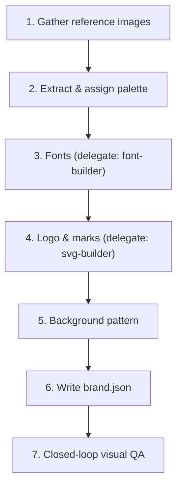

# Brand identity — learning a brand's visual DNA from images

> New to canva-killer, or unsure which skill you need? Start at
> [`../canva-killer-guide/SKILL.md`](../canva-killer-guide/SKILL.md).

Turns reference images into a complete `user/canva-killer/brands/<id>.json` (palette + fonts +
logo + pattern), so every later render for this brand is drawn from real, reasoned identity data
instead of guesses. This is an **orchestration** skill: it drives `font-builder` and `svg-builder`
for their sub-steps instead of duplicating their logic.

## Scope: this skill vs. its siblings

- **This skill (brand-identity)** — the brand's *identity itself*: colors, fonts, logo, pattern.
  Output: `brands/<id>.json` (+ maybe a logo SVG). Run once per brand, or whenever the brand
  refreshes its look.
- **layout-recovery** — a *specific existing design*'s layout/composition (grid, text
  placement). Output: one `templates/<brandId>/<name>.html`. Run per design you want to clone.
  Run brand-identity first if the brand has no `brands/<id>.json` yet — layout-recovery needs
  `{{accent}}`/`{{display}}`/etc. to already resolve to something real.
- **font-builder** / **svg-builder** — single-concern sub-steps (fonts only / one icon-or-mark
  only) that this skill calls internally, and that remain directly usable standalone for a quick
  "just fix the font" or "just make me an icon" ask that isn't a full brand onboarding.

## The Identity Pipeline



### 1. Gather reference images
Ask for (or use what was already shared): a real post/ad, a screenshot of their site/app, a
business card, a brand guideline PDF page. More surfaces = more reliable palette (a single busy
photo is a worse source than a clean logo lockup or a solid-color banner). If the only image
available is content-heavy and not itself brand material (e.g. a generic stock-photo ad), say so
and ask whether it's actually representative — don't silently treat photo noise as brand color.

### 2. Extract & assign palette
Don't eyeball hex codes directly from the image — run the deterministic extractor first, then
reason over its output:

```bash
node canva-killer/skills/brand-identity/scripts/extract-palette.mjs <image-path> [topN=12]
```

Returns `{ swatches: [...by area], vividOutliers: [...by colorfulness, any area], suggested:
{bg, text, surface, muted, accent, accent2} }`. `swatches` is ranked by how much area each color
covers (right signal for bg/surface/muted — those are genuinely large flat regions).
`vividOutliers` is ranked by colorfulness **across the whole image, regardless of area** — a
brand's real accent (logo mark, small badge, CTA button) is very often a tiny fraction of total
area, so `accent`/`accent2` are picked from here, not from `swatches`.

`suggested` is a **heuristic starting point**, always sanity-check it against the actual image:
- Does `accent` look like the color they use for CTAs/highlights/logo, not an incidental object
  in a photo (e.g. a person's red shirt)?
- Is `text` actually legible on `bg` (it's derived from luminance contrast, but confirm visually)?
- Run the script on more than one reference image if available and reconcile — the color that
  repeats across sources is the real brand color; a one-off is noise.
- `accent2` is optional (only set it if the brand genuinely uses a second highlight color, e.g. a
  gradient or a two-tone CTA) — otherwise drop it and let the render default to `accent`.

**Lesson from calibrating this script against a real job-post image** (small orange logo/badge
on a white-and-navy card): the first version ranked accent candidates by area first, so the
small-but-real orange logo never made the cut — a larger, duller UI-chrome blue won by default.
Fixed by scoring `vividOutliers` on colorfulness over the *entire* pixel population, not just the
top-N-by-area swatches. A second bug surfaced right after: HSL saturation hits its 1.0 ceiling
whenever any RGB channel is exactly 0, regardless of how vivid the color actually looks — several
dull petrol blues scored a flat `saturation: 1` and outranked the real orange (`saturation:
0.88`, but nearly 2x the *absolute* chroma). Fixed by ranking on chroma (`max(r,g,b)-min(r,g,b)`,
no ceiling artifact) instead of HSL saturation. If a future image produces a clearly-wrong
`accent`, check whether it's one of these two failure modes before assuming the image itself is
the problem.

### 3. Fonts — delegate to `font-builder`
Follow [`../font-builder/SKILL.md`](../font-builder/SKILL.md) steps 1–2 (visual identification +
Google Fonts mapping) against the same reference images. Don't re-derive the font-matching table
here — it already lives in that skill.

### 4. Logo & marks — delegate to `svg-builder`
- If a clean vector/transparent logo exists (brand site, press kit), fetch and save it to
  `user/canva-killer/assets/custom/<id>/logo.svg` (brand-scoped, `<id>` matching this brand's
  `id`), reference it as `"logo": "custom/logo"`.
- If only a raster logo is visible in a reference image (e.g. embossed on a photo) and no clean
  source is found, follow [`../svg-builder/SKILL.md`](../svg-builder/SKILL.md) to hand-trace a
  clean vector version — only if it's simple/geometric enough (svg-builder's own honesty limit
  applies: don't attempt a full illustrative trace).
- If neither works, fall back to `"logoText"` (clean uppercase wordmark) — don't block the rest
  of the pipeline on a missing logo.

### 5. Background pattern
Pick the closest match from `partials/base.css`'s procedural patterns by looking at the
reference's background texture: `grid` (default), `dots`, `scanlines`, `mesh`, `hatch`, `noise`,
`none` (flat). Most brand material is flat — `none` or `grid` at low `patternOpacity` is the safe
default when unsure; don't force a busy pattern onto a brand whose real material is plain.

### 6. Write brand.json
Create/update `user/canva-killer/brands/<id>.json` (see
[`../../brands/_TEMPLATE.json`](../../brands/_TEMPLATE.json) for the shape):

```json
{
  "id": "brand-id",
  "name": "Brand Name",
  "handle": "@brandhandle",
  "logoText": "BRAND",
  "logo": "custom/logo",
  "pattern": "none",
  "patternOpacity": 1,
  "palette": { "bg": "#...", "surface": "#...", "text": "#...", "muted": "#...", "accent": "#...", "accent2": "#..." },
  "fonts": { "display": "'...', system-ui, sans-serif", "mono": "'...', ui-monospace, monospace" }
}
```
`id` becomes the brand's namespace everywhere downstream — it's also the folder name for any
templates authored exclusively for this brand (`user/canva-killer/templates/<id>/`), so pick it
once and keep it consistent (don't let a template folder drift to a different spelling than the
brand's real `id`, e.g. a nickname — that mismatch is what breaks the isolation between brands).

### 7. Closed-loop visual QA
Don't ship the JSON unchecked:
1. Render a quick test card with a generic template (`post-square`) and a couple of `data` fields
   using this brand: `node src/render.mjs --brand <id> --template post-square --data <tmp.json>`.
2. Compare the output PNG side-by-side against the reference image(s): does the palette read as
   "the same brand" at a glance? Is text legible? Does the accent pop the way it does in the
   reference?
3. Adjust `palette`/`pattern` and re-render until it does. This mirrors `layout-recovery`'s QA
   loop — same discipline, applied to identity instead of layout.

## See also
- [`../font-builder/SKILL.md`](../font-builder/SKILL.md) — fonts sub-step (also usable standalone).
- [`../svg-builder/SKILL.md`](../svg-builder/SKILL.md) — logo/icon sub-step (also usable standalone).
- [`../layout-recovery/SKILL.md`](../layout-recovery/SKILL.md) — clone an existing design's
  *layout* once this brand's identity already exists.
