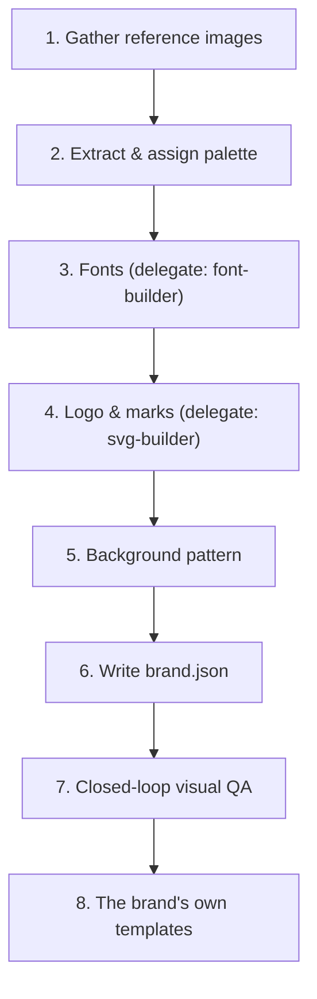

# Brand identity — learning a brand's visual DNA from images

> New to canva-killer, or unsure which skill you need? Start at
> [`../canva-killer-guide/SKILL.md`](../canva-killer-guide/SKILL.md).

Turns reference images into a complete `user/canva-killer/brands/<id>.json` (palette + fonts +
logo + pattern), so every later render for this brand is drawn from real, reasoned identity data
instead of guesses. This is an **orchestration** skill: it drives `font-builder` and `svg-builder`
for their sub-steps instead of duplicating their logic.

## Scope: this skill vs. its siblings

- **This skill (brand-identity)** — the brand's *identity itself*: colors, fonts, logo, pattern.
  Output: `brands/<id>.json` (+ maybe a logo SVG). Run once per brand, or whenever the brand
  refreshes its look.
- **layout-recovery** — a *specific existing design*'s layout/composition (grid, text
  placement). Output: one `templates/<brandId>/<name>.html`. Run per design you want to clone.
  Run brand-identity first if the brand has no `brands/<id>.json` yet — layout-recovery needs
  `{{accent}}`/`{{display}}`/etc. to already resolve to something real.
- **font-builder** / **svg-builder** — single-concern sub-steps (fonts only / one icon-or-mark
  only) that this skill calls internally, and that remain directly usable standalone for a quick
  "just fix the font" or "just make me an icon" ask that isn't a full brand onboarding.

## The Identity Pipeline


```mermaid
graph TD
    A["1. Gather reference images"] --> B["2. Extract & assign palette"]
    B --> C["3. Fonts (delegate: font-builder)"]
    C --> D["4. Logo & marks (delegate: svg-builder)"]
    D --> E["5. Background pattern"]
    E --> F["6. Write brand.json"]
    F --> G["7. Closed-loop visual QA"]
    G --> H["8. The brand's own templates"]
```

### 1. Gather reference images — and ASK for the logo file
Ask for (or use what was already shared):
- **Reference images**: a real post/ad, a screenshot of their site/app, a business card, a brand
  guideline page. More surfaces = more reliable palette (a single busy photo is a worse source
  than a clean logo lockup or a solid-color banner). If the only image is content-heavy and not
  itself brand material, say so and ask whether it's representative.
- **The logo as a FILE** (SVG ideally; PNG with transparency is fine). Every brand has one — ask
  before trying anything clever. Step 4 explains what to do with it and what the fallback is when
  the user genuinely has nothing but a print.

Treat the whole job as an outside agency would: the prints and files the user hands you are the
only source. Don't go digging in a repository or site source for CSS variables and font files —
even when you technically could — unless the user tells you to use it.

### 2. Extract & assign palette
Don't eyeball hex codes from the image — measure, then reason over the measurement. Feed the
extractor **every** reference you have at once (it reconciles across them) and ask for the sheet:

```bash
node canva-killer/skills/brand-identity/scripts/extract-palette.mjs ref1.png ref2.jpg site.png \
  --sheet /tmp/palette-sheet.png
```

Then **look at the sheet PNG** (references + role swatches + all clusters with their share). The
JSON has:
- `roles` — `{bg, surface, text, muted, accent, accent2?}`, ready to paste into `palette`.
- `derived` — roles no real cluster could fill, so they were *computed* (e.g. `surface` = bg ±6%,
  `text` = white/black by bg luminance). Measured roles are trustworthy; derived ones are
  placeholders you should confirm against the brand's actual material or leave as sane defaults.
- `contrast` — WCAG ratios (`textOnBg`, `accentOnBg`, ...). Text below 4.5:1 is auto-replaced;
  accent below 3:1 gets a warning (fine for fills, weak for kicker/CTA text).
- `warnings` — photo-like edges, monochrome brand, possible gradient/duo-tone, weak accent text.
- `clusters` — every color with `sharePct` and `images` (in how many references it recurs). A
  color present in 3/3 references is the brand; one present in 1/3 is content.

How it decides (so you can tell when it's wrong): background = dominant color of the outer border
ring (a photo in the middle can't hijack it); accent = most *chromatic* cluster anywhere in the
image (a 0.3% logo mark still wins over a dull 10% UI chrome), boosted when it recurs across
references; accent2 must differ from accent by >35° of hue. Colors are clustered in OKLab, so
antialiasing/JPEG neighbors merge into one swatch instead of fragmenting.

Sanity checks that are still yours to make:
- Is `accent` the color of their CTAs/highlights/logo — not a person's shirt in a photo? If a
  reference is a busy photo, the JSON says so (`busy edges`); add a screenshot of the site or a
  logo lockup and rerun.
- If the warning mentions gradient/duo-tone and the reference really uses one, set
  `brand.gradient` (see step 6) and keep `accent2`; otherwise drop `accent2`.
- A brand can legitimately be monochrome; then `accent` is whatever is most colorful and the
  warning tells you to set it by hand (often = text).

### 3. Fonts — ask for the files, then match the rest
1. **Ask for the brand's font files** (`.woff2`/`.ttf`/`.otf`) the same way you ask for the logo.
   Drop them in `user/canva-killer/fonts/<id>/` named `<Family Name>-<weight>[-italic].woff2`
   (the person can also upload them in the studio's Brand tab, which shows every role with a
   live sample — point them there when they'd rather pick fonts by eye)
   (e.g. `Montserrat-300.woff2`, `My Serif-700.otf`) — they become `@font-face` rules in every
   render and in the studio automatically, and that family is no longer fetched from Google.
   This is the only path to real fidelity; a Google stand-in is always an approximation.
2. For fonts the user can't supply, follow [`../font-builder/SKILL.md`](../font-builder/SKILL.md)
   steps 1–2 (visual identification → Google Fonts stand-in). Say which fonts are stand-ins in
   the brand JSON `_source` so nobody mistakes them for the real thing.
3. Name font roles after their job in `fonts` (`display`, `mono`, `body`, `kicker`, `cta`…) and
   use them in templates as `{{font:<role>}}`. Note the **weight**, not just the family — a light
   300 kicker rendered at 400 reads as a different brand (this exact miss happened on a real
   test). Google stand-ins load 300/400/500/600/700 where the family has them.

### 4. Logo & marks
Three cases, in order of preference:
1. **User supplied a file** (the normal case). SVG: save it to
   `user/canva-killer/assets/custom/<id>/logo.svg` (brand-scoped, `<id>` = this brand's `id`),
   swap hard-coded fills for `currentColor` so it recolors with `{{text}}`/`{{accent}}`, and set
   `"logo": "custom/logo"`. A two-color logo (e.g. green + cyan strokes) may keep its colors —
   then it simply ignores the container color. Extra marks (emblem, mascot, seal) go in the same
   folder and are used as `{{icon:custom/<name>}}`. PNG only: wrap it in an `<svg><image …/></svg>`
   (see `scripts/cut-logo.mjs` for the mask trick that makes even a raster recolorable).
2. **No file, but the logo is clean and geometric** in a reference: hand-trace it with
   [`../svg-builder/SKILL.md`](../svg-builder/SKILL.md) (its honesty limit applies — no
   illustrative traces, no blackletter, no lettering).
3. **No file, complex logo** (lettering, blackletter, illustration): cut it out of the sharpest
   print instead of guessing —
   ```bash
   node canva-killer/skills/brand-identity/scripts/cut-logo.mjs <print> --box x,y,w,h \
     --out user/canva-killer/assets/custom/<id>/logo.svg [--mode light|dark] [--preview /tmp/logo.png]
   ```
   `--box` comes from `measure-layout.mjs --overlay` (the block bbox) or the grid. The result is a
   recolorable alpha mask, crisp at the print's size and soft when blown up — tell the user it's
   a stopgap and ask for the real file again.
4. **Nothing works**: `"logoText"` (clean uppercase wordmark). Never block the pipeline on a logo.

### 5. Background pattern
Default is **`none`** (flat) — a pattern is a brand decision, never a platform default. Only set
`grid`/`dots`/`scanlines`/`mesh`/`hatch`/`noise` when the reference material visibly has that
texture, and tune `patternOpacity` (0–1) until it reads like the reference, not louder.

### 6. Write brand.json
Create/update `user/canva-killer/brands/<id>.json` (see
[`../../brands/_TEMPLATE.json`](../../brands/_TEMPLATE.json) for the shape):

```json
{
  "id": "brand-id",
  "name": "Brand Name",
  "handle": "@brandhandle",
  "logoText": "BRAND",
  "logo": "custom/logo",
  "pattern": "none",
  "patternOpacity": 1,
  "gradient": "linear-gradient(95deg, #35d97b, #3ecfe6)",
  "palette": { "bg": "#...", "surface": "#...", "text": "#...", "muted": "#...", "accent": "#...", "accent2": "#..." },
  "fonts": { "display": "'...', system-ui, sans-serif", "mono": "'...', ui-monospace, monospace", "body": "'...', sans-serif" },
  "variants": { "light": { "bg": "#...", "surface": "#...", "text": "#...", "muted": "#...", "accent": "#..." } }
}
```
Everything in this file is reachable from templates: palette keys as `{{bg}}`…`{{accent2}}`;
fonts as `{{font:<key>}}` (`{{font:body}}`, `{{font:cta}}`… — `{{display}}`/`{{mono}}` also work
bare; every named family is loaded from Google Fonts automatically, one request per family so a
family lacking a weight doesn't break the others); any top-level scalar as a token
(`{{gradient}}`, `{{tagline}}`). Name font roles after their *job* (`cta`, `kicker`, `body`),
they never clash with content fields because of the `font:` prefix. `gradient` defaults to `accent → accent2` when omitted. `variants` are optional
palette overrides selectable per render with `data.variant` (`"light"`, `"metallic"`…) — record
them when the brand material shows a real light/dark or alternate scheme, not as a guess.

`id` becomes the brand's namespace everywhere downstream — it's also the folder name for any
templates authored exclusively for this brand (`user/canva-killer/templates/<id>/`), so pick it
once and keep it consistent (don't let a template folder drift to a different spelling than the
brand's real `id`, e.g. a nickname — that mismatch is what breaks the isolation between brands).

### 7. Closed-loop visual QA
Don't ship the JSON unchecked:
1. Render a quick test card with a generic template (`post-square`) and a couple of `data` fields
   using this brand: `node src/render.mjs --brand <id> --template post-square --data <tmp.json>`.
2. Score it against the reference, don't just eyeball it:
   ```bash
   node canva-killer/skills/brand-identity/scripts/compare.mjs <reference.png> <render.png> --out /tmp/cmp.png
   ```
   `paletteScore` is the per-role OKLab distance between the reference's and the render's
   extracted roles (`roleDelta` names the offender); `verdict` lists what is off. Open the `--out`
   sheet: both images at the same height with their role swatches underneath — the fastest way to
   see "same brand?" Aim for `paletteScore` ≥ 80; below that, one role is clearly wrong.
3. Adjust `palette`/`pattern`, re-render, re-compare until the score stops moving and the sheet
   reads as the same brand. Same discipline as `layout-recovery`'s QA loop, applied to identity.

### 8. The brand's own templates — the onboarding isn't done without them
A brand JSON alone only feeds the framework's **neutral skeletons** (`post-square`, `story`,
`blog-cover`, `carrossel-slide`): flat, undecorated layouts that show the palette/fonts/logo and
nothing else. They are placeholders, not "the brand's look". Finish onboarding by turning the
reference posts into real layouts:
1. For each reference post that represents a recurring format (launch, quote, carousel slide,
   story…), run [`../layout-recovery/SKILL.md`](../layout-recovery/SKILL.md) → one
   `user/canva-killer/templates/<id>/<format>.html` each. Two or three formats already cover most
   of a brand's feed.
2. Give image blocks slot tokens (`{{img:hero}}`) and keep text as `{{tokens}}` so the same
   template serves every future post.
2b. **If the brand posts carousels**, its post-type templates are the *covers* (slide 1) and it
   needs a small **page family** for the slides that follow — `slide-texto`, `slide-lista`,
   `slide-numero`, `slide-citacao`, `slide-imagem`, `slide-passo`, `slide-cta` (name them after
   what a slide *says*, not after a post type). Each page: same lockup as the covers, a
   `{{slide}} / {{slidetotal}}` counter, an optional image slot (`{{img:media}}` collapsed via
   `{{has:media}}`), and a `variant` if the brand alternates backgrounds. Covers that can open a
   carousel also carry the counter (hidden when the post is single). One family serves every
   cover; don't author per-cover inner slides.
3. Once the brand has its own layouts, set `"genericTemplates": false` in the brand JSON so the
   skeletons stop showing up in `list_templates` and in the studio for that brand.
4. Render one real post per template, `compare.mjs` against its reference, and only then call the
   brand onboarded.

_TEMPLATE.json`](../../brands/_TEMPLATE.json) for the shape):

```json
{
  "id": "brand-id",
  "name": "Brand Name",
  "handle": "@brandhandle",
  "logoText": "BRAND",
  "logo": "custom/logo",
  "pattern": "none",
  "patternOpacity": 1,
  "gradient": "linear-gradient(95deg, #35d97b, #3ecfe6)",
  "palette": { "bg": "#...", "surface": "#...", "text": "#...", "muted": "#...", "accent": "#...", "accent2": "#..." },
  "fonts": { "display": "'...', system-ui, sans-serif", "mono": "'...', ui-monospace, monospace", "body": "'...', sans-serif" },
  "variants": { "light": { "bg": "#...", "surface": "#...", "text": "#...", "muted": "#...", "accent": "#..." } }
}
```
Everything in this file is reachable from templates: palette keys as `{{bg}}`…`{{accent2}}`;
fonts as `{{font:<key>}}` (`{{font:body}}`, `{{font:cta}}`… — `{{display}}`/`{{mono}}` also work
bare; every named family is loaded from Google Fonts automatically, one request per family so a
family lacking a weight doesn't break the others); any top-level scalar as a token
(`{{gradient}}`, `{{tagline}}`). Name font roles after their *job* (`cta`, `kicker`, `body`),
they never clash with content fields because of the `font:` prefix. `gradient` defaults to `accent → accent2` when omitted. `variants` are optional
palette overrides selectable per render with `data.variant` (`"light"`, `"metallic"`…) — record
them when the brand material shows a real light/dark or alternate scheme, not as a guess.

`id` becomes the brand's namespace everywhere downstream — it's also the folder name for any
templates authored exclusively for this brand (`user/canva-killer/templates/<id>/`), so pick it
once and keep it consistent (don't let a template folder drift to a different spelling than the
brand's real `id`, e.g. a nickname — that mismatch is what breaks the isolation between brands).

### 7. Closed-loop visual QA
Don't ship the JSON unchecked:
1. Render a quick test card with a generic template (`post-square`) and a couple of `data` fields
   using this brand: `node src/render.mjs --brand <id> --template post-square --data <tmp.json>`.
2. Score it against the reference, don't just eyeball it:
   ```bash
   node canva-killer/skills/brand-identity/scripts/compare.mjs <reference.png> <render.png> --out /tmp/cmp.png
   ```
   `paletteScore` is the per-role OKLab distance between the reference's and the render's
   extracted roles (`roleDelta` names the offender); `verdict` lists what is off. Open the `--out`
   sheet: both images at the same height with their role swatches underneath — the fastest way to
   see "same brand?" Aim for `paletteScore` ≥ 80; below that, one role is clearly wrong.
3. Adjust `palette`/`pattern`, re-render, re-compare until the score stops moving and the sheet
   reads as the same brand. Same discipline as `layout-recovery`'s QA loop, applied to identity.

## See also
- [`../font-builder/SKILL.md`](../font-builder/SKILL.md) — fonts sub-step (also usable standalone).
- [`../svg-builder/SKILL.md`](../svg-builder/SKILL.md) — logo/icon sub-step (also usable standalone).
- [`../layout-recovery/SKILL.md`](../layout-recovery/SKILL.md) — clone an existing design's
  *layout* once this brand's identity already exists.
