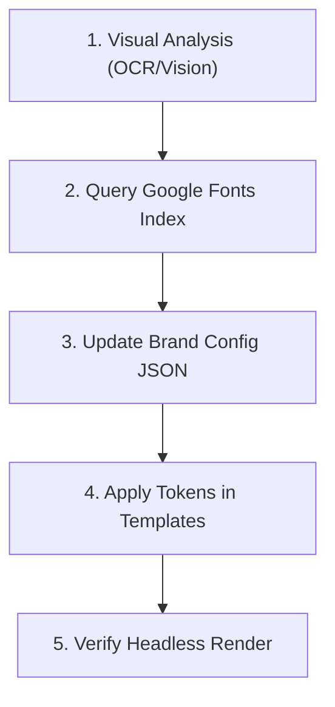

# Font builder — Visual identification & typography configuration

Use this routine to identify, match, and configure brand fonts from visual assets (images, PDFs, screenshots) so they render dynamically and deterministically.

---

## The Step-by-Step Routine



### 1. Visual Analysis (OCR & Font Style Detection)
Use vision capabilities or visual OCR to analyze a reference image or PDF slide. Identify the primary typographical layers:
- **Display/Title Font**: Look at the headlines. Are they geometric (like *Inter* or *Outfit*), brutalist/wide (like *Space Grotesk*), classic editorial (like *EB Garamond*), or pixel-art retro?
- **Monospace/Technical Font**: Look at footers, handles, terminal window headers, or dates. Are they fixed-width/code fonts?
- **Body Font**: Look at descriptions. Is it a highly readable sans-serif or serif font?

### 2. Map Styles to Google Fonts Alternatives
Query the following curated list of high-quality Google Fonts to find the closest aesthetic matches:

| Reference Font Style | Google Fonts Equivalent | Vibe/Industry |
|----------------------|-------------------------|---------------|
| **Futura, Avant Garde** | `Outfit`, `Poppins` | Modern, premium, geometric |
| **Helvetica, Arial** | `Inter`, `Plus Jakarta Sans` | Clean, corporate, legible UI |
| **Courier, Consolas** | `JetBrains Mono`, `Fira Code` | Technical, terminal, developer |
| **Baskerville, Garamond** | `EB Garamond`, `Lora` | Academic, premium, editorial |
| **Wide Tech Sans** | `Space Grotesk`, `Syne` | Brutalist, Web3, cyberpunk |

### 3. Configure the Brand JSON
Create or modify the brand config file at:
`user/canva-killer/brands/<brand-id>.json`

Define the display and mono fonts using CSS font-family strings with system fallbacks.
- **Zero-Config Google Fonts Feature**: Do **NOT** manually populate the `googleFonts` key in the JSON file. The rendering engine will automatically parse the font names from `display` and `mono` (extracting names like `"Space Grotesk"` or `"JetBrains Mono"`), filter out system fallbacks (like `sans-serif` or `monospace`), and construct the API link dynamically.

#### Example Config:
```json
{
  "id": "scientific-brand",
  "name": "Genomic Labs",
  "handle": "@genomiclabs",
  "logoText": "GENOMIC.LABS",
  "palette": {
    "bg": "#0b0f19",
    "surface": "#1e293b",
    "text": "#f8fafc",
    "muted": "#64748b",
    "accent": "#06b6d4"
  },
  "fonts": {
    "display": "'Outfit', system-ui, sans-serif",
    "mono": "'Fira Code', ui-monospace, monospace"
  }
}
```

### 4. Apply Tokens in Templates
Ensure the HTML layout template consumes these font variables correctly:
- In the HTML `<head>` tag, include the link placeholder to inject the resolved Google Fonts URL:
  ```html
  <link href="{{googleFonts}}" rel="stylesheet">
  ```
- In the CSS stylesheets or inline style attributes, apply the display and mono font families using the tokens `{{display}}` and `{{mono}}`:
  ```css
  #canvas {
    font-family: {{display}};
  }
  .monospace-text {
    font-family: {{mono}};
  }
  ```

### 5. Verify Headless Render
Test that the dynamic loader fetches the font files and that headless Chrome outputs the texts correctly:
1. Run a render command pointing to your brand and template:
   ```bash
   node src/render.mjs --brand <brand-id> --template <template-name> --data <data-json-path>
   ```
2. Inspect the output PNG in `user/canva-killer/out/` to check for text clipping, alignment, and correct visual loading of the font faces.
