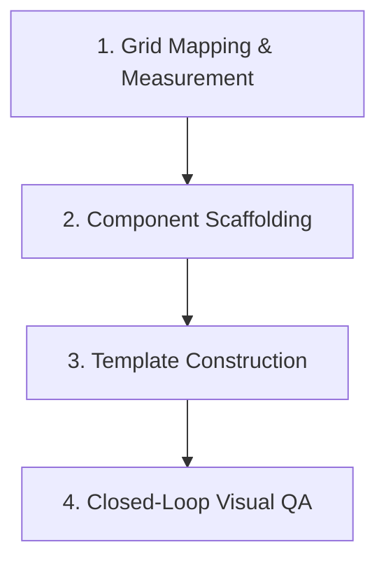

# Layout Recovery — Reverse-Engineering & Visual QA

Use this skill when you need to recreate an existing design layout (e.g. from an uploaded PDF, PNG, or screenshot) as a Canva Killer template. This routine prevents layout hallucinations by enforcing strict measurement and visual validation.

---

## The Recovery Pipeline



### 1. Grid Mapping & Measurement
Before writing any code, analyze the reference image and define the grid structure:
- **Canvas Size**: Identify the aspect ratio. Standard Canva Killer dimensions:
  - Square: `1080 x 1080`
  - Portrait Slide: `1080 x 1350`
  - Story: `1080 x 1920`
  - Blog Cover: `1200 x 630`
- **Coordinate Grid**: Map the elements in pixels relative to the canvas size:
  - Estimate the bounding boxes `(left, top, width, height)` of titles, kickers, images, and CTA blocks.
  - Estimate font sizes, line heights, and margins/paddings.
  - Identify background styles (colors, pattern types, overlays).

### 2. Component Scaffolding
- **Custom Icons & Backgrounds**: If the reference has specific vector decorations (e.g. borders, curves, grids), use the `svg-builder` skill to generate them and save to `user/canva-killer/assets/custom/`.
- **Typography matching**: Use the `font-builder` skill to identify display/monospace fonts from Google Fonts and update the target brand JSON file.

### 3. Template Construction
- Create the brand-specific template inside the gitignored user overlay templates folder:
  `user/canva-killer/templates/<template-name>.html`
- Build the HTML container structure. Set `#canvas` to the mapped dimensions.
- Embed all static SVG assets or layouts.
- Use tokens like `{{display}}`, `{{mono}}`, `{{accent}}`, `{{surface}}`, and `{{text}}` to ensure the layout remains brand-agnostic.
- Inject text variables like `{{titulo}}`, `{{kicker}}`, `{{cta}}` to allow Compose form substitution.
- Make the template **code-only** (do NOT include the visual editor `<script type="application/json" data-ck-model>` block) if it features complex custom SVG borders, terminal windows, or dynamic scripting. This prevents visual editor saves from stripping your custom markup.

### 4. Closed-Loop Visual QA (Visual Validation)
Do not assume the template looks correct on the first try. You must run a validation loop:
1. **Render Test**: Run the headless renderer using the brand styles and a test JSON payload:
   ```bash
   node src/render.mjs --brand <brand-id> --template <template-name> --data <data-json-path>
   ```
2. **Visual Contrast & Diff**: Inspect the output PNG inside `user/canva-killer/out/` and compare it side-by-side with the original user-uploaded reference image:
   - Are the margins aligned?
   - Is the text scaling correctly without clipping?
   - Do the colors and SVG strokes match?
3. **Iterative Adjustments**: Edit the HTML template coordinate styles, run the render command again, and re-check. Repeat this loop until the visual diff is minimized and the layout matches the reference.
