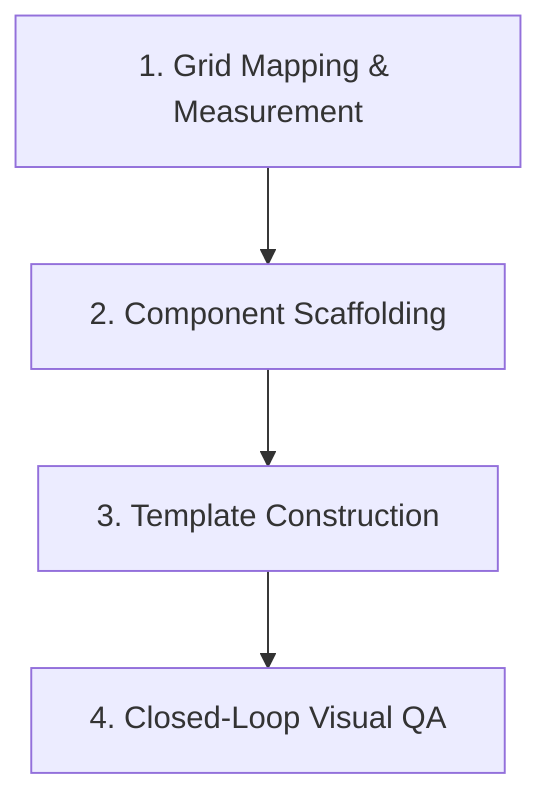

# Layout Recovery — Reverse-Engineering & Visual QA

> New to canva-killer, or unsure which skill you need? Start at
> [`../canva-killer-guide/SKILL.md`](../canva-killer-guide/SKILL.md).

Use this skill when you need to recreate an existing design layout (e.g. from an uploaded PDF, PNG, or screenshot) as a Canva Killer template. This routine prevents layout hallucinations by enforcing strict measurement and visual validation.

---

## The Recovery Pipeline


```mermaid
graph TD
    A["1. Grid Mapping & Measurement"] --> B["2. Component Scaffolding"]
    B --> C["3. Template Construction"]
    C --> D["4. Closed-Loop Visual QA"]
```

### 1. Grid Mapping & Measurement
Measure the reference before writing a line of CSS — vision models are good at *what* is in an
image and bad at *where exactly* it is in pixels. Run:

```bash
node canva-killer/skills/layout-recovery/scripts/measure-layout.mjs <reference.png> \
  --overlay /tmp/ref-grid.png [--canvas 1080x1350]
```

It prints and draws:
- **Canvas**: reference size, aspect, the nearest standard format (`post 1080x1080`,
  `portrait 1080x1350`, `story 1080x1920`, `cover 1200x630`) and `scaleToCanvas` (reference px →
  canvas px). Pass `--canvas` to force a target.
- **Background** (border-ring color, `photoLike` flag) and the **content bbox → real margins**
  in px and %. Use those margins as `#canvas` padding instead of guessing.
- **Blocks**: rows of content split by whitespace, each with bbox (`px`, `pct`, and already
  scaled to `canvas`), dominant color, and for text an estimated `lines` / `linePitchPx` /
  `fontSizePx` (+ `fontSizeCanvas`). Adjacent text blocks with the same color and left edge are
  usually one paragraph whose lines were split — merge them mentally.
- **`--overlay`**: the reference with a labeled 10% grid and numbered block boxes. **Read
  positions off this image**, then write the template from the numbers — not from the raw
  reference.

Font-size estimates come from line pitch (÷1.15) or glyph-box height (÷0.9); treat them as ±10%
and confirm in step 4. On a photo-heavy reference the block list is unreliable where the photo
is — the grid overlay still gives you the geometry.

### 2. Component Scaffolding
- **Custom Icons & Backgrounds**: If the reference has specific vector decorations (e.g. borders, curves, grids), use the `svg-builder` skill to generate them and save to `user/canva-killer/assets/custom/`.
- **Typography matching**: Use the `font-builder` skill to identify display/monospace fonts from Google Fonts and update the target brand JSON file.

### 3. Template Construction
- Create the brand-specific template inside the gitignored user overlay templates folder, scoped
  to that brand: `user/canva-killer/templates/<brand-id>/<template-name>.html` — `<brand-id>`
  must match the target brand's `id` field exactly. Templates are brand-scoped: a template
  dropped flat into `user/canva-killer/templates/` (no brand subfolder) is visible to every
  brand, not just this one — never do that for a design authored to match one specific brand.
- Build the HTML container structure. Set `#canvas` to the mapped dimensions.
- Embed all static SVG assets or layouts.
- Use tokens like `{{display}}`, `{{mono}}`, `{{accent}}`, `{{surface}}`, and `{{text}}` to ensure the layout remains brand-agnostic.
- Inject text variables like `{{titulo}}`, `{{kicker}}`, `{{cta}}` to allow Compose form substitution.
- Image slots the agent fills per post: `background-image:url('{{img:hero}}')` — `data.hero`
  (local path or URL) resolves at render time. `{{gradient}}` gives the brand's duo gradient
  (or `accent → accent2` when the brand doesn't declare one); `data.variant` swaps to a brand
  `variants.<name>` palette (e.g. a light version of the same layout).
- Make the template **code-only** (do NOT include the visual editor `<script type="application/json" data-ck-model>` block) if it features complex custom SVG borders, terminal windows, or dynamic scripting. This prevents visual editor saves from stripping your custom markup.

**Height**: prefer `#canvas{height:auto}` with content in normal document flow over a guessed
fixed height + `overflow:hidden`. The render engine measures `#canvas`'s real bounding box after
render and sizes the screenshot to it — a fixed height just risks silently clipping content that
runs long (confirmed on a real job-post recovery: a guessed 1520px height clipped the entire last
section off-screen with no error, only caught by looking at the render). Reserve absolute
positioning for elements that must overlap a boundary (e.g. a badge overlapping the header photo).

### 4. Closed-Loop Visual QA (Visual Validation)
Do not assume the template looks correct on the first try. You must run a validation loop:
1. **Render Test**: Run the headless renderer using the brand styles and a test JSON payload
   (`--brand` scopes template resolution to that brand's folder, same id used in step 3):
   ```bash
   node src/render.mjs --brand <brand-id> --template <template-name> --data <data-json-path>
   ```
2. **Measured diff**, then visual diff:
   ```bash
   node canva-killer/skills/brand-identity/scripts/compare.mjs <reference.png> <render.png> --out /tmp/cmp.png
   ```
   `geometryScore` covers aspect ratio, margin drift (%), and block-count difference;
   `paletteScore` covers the colors; `verdict` names what's off. Then open the `--out` sheet
   (reference and render side by side, same height) and check what metrics can't:
   - Are the margins aligned? Is the text scaling correctly without clipping?
   - Do the colors and SVG strokes match? Is the type hierarchy (title > kicker > body) preserved?
   You can also run `measure-layout.mjs --overlay` on the RENDER and compare block bboxes with the
   reference's, number by number.
3. **Iterative Adjustments**: Edit the HTML template coordinate styles, run the render command again, and re-check. Repeat this loop until the visual diff is minimized and the layout matches the reference.

## See also
- [`../brand-identity/SKILL.md`](../brand-identity/SKILL.md) — run this FIRST if the target
  brand has no `brands/<id>.json` yet; this skill clones *layout*, not identity, and needs
  `{{accent}}`/`{{display}}`/etc. to already resolve to something real.
- [`../svg-builder/SKILL.md`](../svg-builder/SKILL.md) / [`../font-builder/SKILL.md`](../font-builder/SKILL.md) — sub-steps this skill calls in step 2 for decorations and typography.
